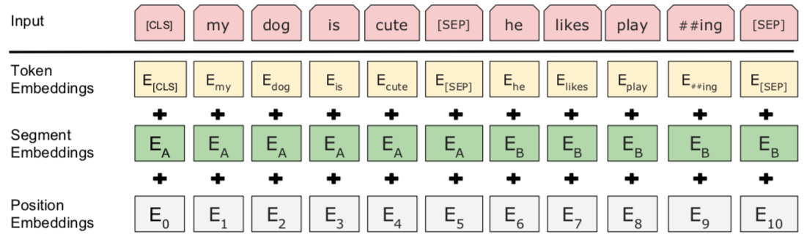
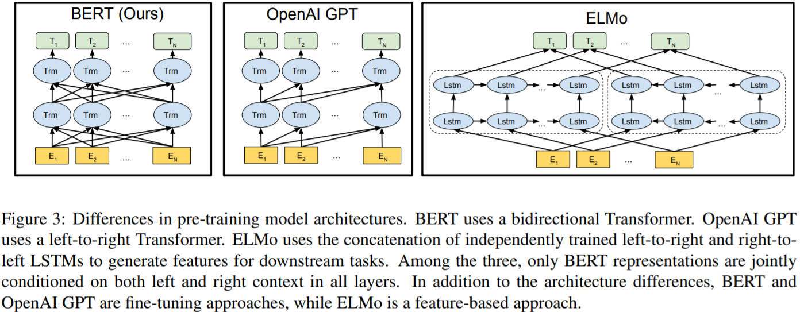

# Bert

全称：**Bidirectinal Encoder Representation from Transformer**  
是 Google 以无监督的方式利用大量**无标注**的文本练成的**语言模型**

Google 在训练 Bert 时让他同时进行两个预训练任务：

1. 完形填空 Masked Language Model
2. 判断第 2 个句子在原始文本中与第 1 个是否相接 Next Sentence Prediction


## 语言模型 LM 的好处

- 无监督数据无限大，不用找人来标注数据
- 能顾学习语法结构、解读语义和指代消解（Coreference Resolution），能更有效的训练下游任务并提高其表现
- 减少处理不同 NLP 任务所需 architecture engineering 成本（人力、时间、计算资源）

## 迁移学习

- 先以 LM Pretraining 的方式预先训练出一个对自然语言有一定「理解」的通用模型
- 再将该模型拿來做特征提取或是 fine tune 下游的（监督式）任务

## Bert 预训练任务一：Masked Language Model

先用 transfomers 中的 bert 预训练模型感受一下哈~

```python
import torch
from transformers import BertTokenizer
from IPython.display import clear_output

"""使用中文 BERT-BASE 预训练模型 Use Bert!"""

PRETRAINED_MODEL_NAME = "bert-base-chinese"
# 取得此预训练模型所使用的 tokenizer
tokenizer = BertTokenizer.from_pretrained(PRETRAINED_MODEL_NAME)

clear_output()
vocab = tokenizer.vocab
print("字典大小", len(vocab))
text = "[CLS] 等到潮水 [MASK] 了，就知道谁没穿裤子。"
tokens = tokenizer.tokenize(text)
ids = tokenizer.convert_tokens_to_ids(tokens)

print(text)
print(tokens[:10], "...")
print(ids[:10], "...")
"""
[CLS] 等到潮水 [MASK] 了，就知道誰沒穿褲子。
['[CLS]', '等', '到', '潮', '水', '[MASK]', '了', '，', '就', '知'] ...
[101, 5023, 1168, 4060, 3717, 103, 749, 8024, 2218, 4761] ...
"""
```

```python
"""载入已经训练好的 masked 语言模型并对有 [MASK] 的句子做预测"""
from transformers import BertForMaskedLM

# 除了 tokens 以外我們还需要辨別句子的 segment ids
tokens_tensor = torch.tensor([ids])  # (1, seq_len)
segments_tensors = torch.zeros_like(tokens_tensor)  # (1, seq_len)
maskedLM_model = BertForMaskedLM.from_pretrained(PRETRAINED_MODEL_NAME)
clear_output()

# 使用 masked LM 估计 [MASK] 位置所代表的实际 token
maskedLM_model.eval()
with torch.no_grad():
    outputs = maskedLM_model(tokens_tensor, segments_tensors)
    predictions = outputs[0]
    # (1, seq_len, num_hidden_units)
del maskedLM_model

# 将 [MASK] 位置的分布取 top k 最有可能的 tokens 出來
masked_index = 5
k = 3
probs, indices = torch.topk(torch.softmax(predictions[0, masked_index], -1), k)
predicted_tokens = tokenizer.convert_ids_to_tokens(indices.tolist())

# 我们取 top 1 当做预测值
print("输入 tokens ：", tokens[:10], "...")
print("-" * 50)
for i, (t, p) in enumerate(zip(predicted_tokens, probs), 1):
    tokens[masked_index] = t
    print("Top {} ({:2}%)：{}".format(
        i, int(p.item() * 100), tokens[:10]), "...")
```

```python
"""
輸入 tokens ： ['[CLS]', '等', '到', '潮', '水', '[MASK]', '了', '，', '就', '知'] ...
--------------------------------------------------
Top 1 (82%)：['[CLS]', '等', '到', '潮', '水', '來', '了', '，', '就', '知'] ...
Top 2 (11%)：['[CLS]', '等', '到', '潮', '水', '濕', '了', '，', '就', '知'] ...
Top 3 ( 2%)：['[CLS]', '等', '到', '潮', '水', '過', '了', '，', '就', '知'] ...
"""
```

### Tokens

`[CLS]` 输入序列的 repr., 一般放在句子开头  
 `[SEP]` 分隔符 两个句子的交界，在两个句子之间或是句子末尾  
 `[UNK]` 未出现的词汇 (unknown)  
 `[PAD]` zero_padding 将长度不一样的序列补齐方便做 batch 运算  
 `[MASK]` 未知屏蔽，仅在预训练阶段会用到

### 实现细节

随机遮盖或替换一句话里面的任意字或词，然后让模型通过上下文预测那一个被遮盖或替换的部分，之后做 Loss 的时候也只计算被遮盖部分的 Loss

1. 随机把一句话中 15% 的 token（字或词）替换成以下内容：  
   a. 这些 token 有 80% 的几率被替换成 [MASK]，例如 my dog is hairy→my dog is [MASK]  
   b. 有 10% 的几率被替换成任意一个其它的 token，例如 my dog is hairy→my dog is apple  
   c. 有 10% 的几率原封不动，例如 my dog is hairy→my dog is hairy

2. 之后让模型预测和还原被遮盖掉或替换掉的部分，计算损失的时候，只计算在第 1 步里被随机遮盖或替换的部分，其余部分不做损失，其余部分无论输出什么东西，都无所谓

这样做的好处是，BERT 并不知道 [MASK] 替换的是哪一个词，而且任何一个词都有可能是被替换掉的，比如它看到的 apple 可能是被替换的词。
这样可以强迫模型在编码当前时刻词的时候不能太依赖当前的词，而要考虑它的上下文，甚至根据上下文进行 "纠错"。比如在上面的例子中，模型在编码 apple 时，根据上下文 my dog is，应该把 apple 编码成 hairy 的语义而不是 apple 的语义

## Bert 预训练任务二：Next Sentence Prediction

> LML(完型填空)能让 Bert 更好的 model 每个词汇在不同语境下的 repr.，而 NSP 任务则能帮助 Bert model 两个句子之间的关系，这在问答系统 QA、自然语言推论 NLI 任务有很大帮助



- Token Embedding 就是正常的词向量，即 nn.Embedding()
- Segment Embedding 作用是用 embedding 的信息让模型分开上下句，给上句的 token 全 0，下句的 token 全 1，让模型得以判断上下句的起止位置  
  [CLS]我的狗很可爱[SEP]企鹅不擅长飞行[SEP]  
  0 0 0 0 0 0 0 0 1 1 1 1 1 1 1 1
- Position Embedding 和 Transformer 中的不一样，不是三角函数，而是学习出来的

BERT 预训练阶段实际上是将上述两个任务结合起来，同时进行，然后将所有的 Loss 相加

## ELMo, Bert, Gpt



- [ELMo](https://arxiv.org/abs/1802.05365)(Embedding from Languang model) 利用独立训练的**双向两层 LSTM** 做语言模型并将中间得到的隐状态向量串接当作每个词汇的 contextual word repr.

- [GPT](https://d4mucfpksywv.cloudfront.net/better-language-models/language_models_are_unsupervised_multitask_learners.pdf)(Generative Pre-Training) 则是使用 **Transformer 的 Decoder** 来训练一个中规中矩，从左到右的单向语言模型，使用的数据、参数量庞大

- [BERT](https://arxiv.org/pdf/1810.04805.pdf) 跟它们的差异在于利用**MLM（克漏字）**的概念及**Transformer Encoder**的架构，摆脱以往语言模型只能从单个方向（由左到右或由右到左）估计下个词汇的出现几率，训练出一个双向的语言代表模型。 这使得 BERT 输出的每个 token 的 repr. 都同时蕴含了前后文信息，实现了真正的双向 representation

---

## 引用

[leemeng Bert 巨人之力](https://leemeng.tw/attack_on_bert_transfer_learning_in_nlp.html)  
[Bert note](https://wmathor.com/index.php/archives/1456/)  
[GPT 生成金庸小说](https://leemeng.tw/gpt2-language-model-generate-chinese-jing-yong-novels.html)  
[深度学习资源 repo ](https://github.com/leemengtw/deep-learning-resources)  
[李宏毅 ML 课程](http://speech.ee.ntu.edu.tw/~tlkagk/courses_ML19.html)
[杨夕大佬的 repo](https://github.com/km1994/nlp_paper_study_transformer/tree/main/DL_algorithm/transformer_study/Transformer)
